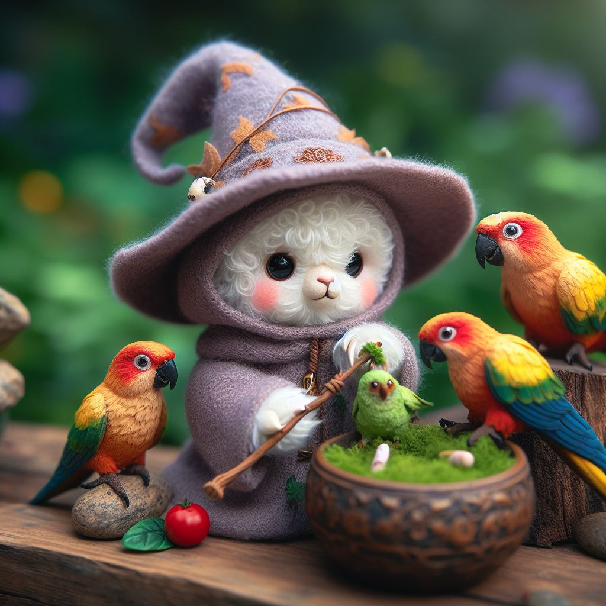

# Chronicles of Aethelgard



## Workshop IA au Snowcamp 2025

L'objectif de ce workshop est de voir comment utiliser un modèle de langage (LLM) pour nous aider à créer un jeu de rôle textuel (RPG).

Nous verrons comment utiliser un modèle de langage pour générer des textes pour diverses situations (description d'une pièce, création d'un personnage, Bot PNJ ...). Ce sera l'occasion de voir comment utiliser l'API d'Ollama pour interagir avec un LLM.

✋ **VOUS N'AVEZ PAS BESOIN DE GPU** 🎉 *(tous mes exemples fonctionnent aussi sur un Raspberry Pi5 8GB RAM)*. 

🐣 Nous verrons donc comment tirer parti d'un **Small Language Model** (ou Tiny Language Model).

✋ **VOUS N'AVEZ PAS BESOIN DE CONNAÎTRE GOLANG** 😊 l'ensemble du code est fourni et **il est trés facile à lire, et je l'expliquerai**, vous n'aurez que des paramètres, des prompts, des phrases, etc. ... à changer et ensuite lancer le code pour interagir avec le ou les LLM por réaliser les étapes suivantes:

### Étapes :

- Générer des descriptions de pièces (dans un donjon)
- Générer des noms de personnages (PNJ)
- Générer des descriptions de personnages (PNJ)
- Créer un service web qui renvoie la description d'une pièce
- Créer un service web Bot PNJ qui répond à des questions
- Ajouter une "mémoire" au Bot PNJ
- Ajouter du RAG (Retrieval Augmented Generation) pour améliorer les réponses du Bot PNJ
- Créer un service web qui renvoie la description d'un monstre
- Créer un service web Bot Boss de fin de niveau qui répond à des questions et vérifie si vous avez les mots magiques pour sortir du donjon

🍒 Et si il nous reste du temps, nous tenterons d'intégrer nos outils dans un jeu de rôle textuel (RPG). Sinon vous aurez tout ce qu'il faut pour continuer par vous même.

### Prérequis :

- Docker & Docker Compose
- VSCode
- Git

Et ensuite : **À FAIRE AVANT DE VENIR** 🙏

```bash
docker pull k33g/chronicles-of-aethelgard:0.0.2
docker pull golang:1.23.4-alpine 
docker pull curlimages/curl:8.6.0
```

> Le Dockerfile de `k33g/chronicles-of-aethelgard` est disponible dans le répertoire `docker`.

Pour vérifier que tout fonctionne :

```bash
docker compose up
```
> Si vous n'avez pas fait les `docker pull` précédents, Docker Compose les fera pour vous.

> 🖐️ Même si vous ne codez pas en Go, le code sera très simple.